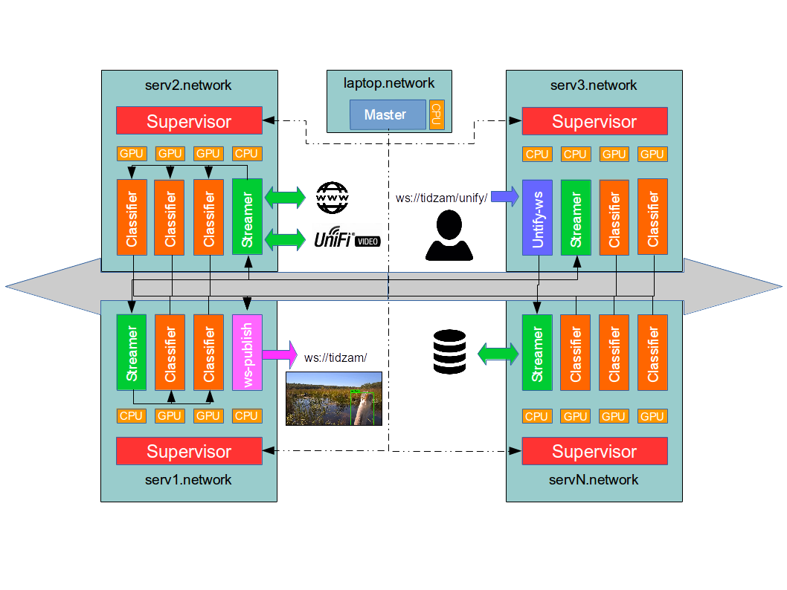

# Introduction

<a href="https://www.youtube.com/watch?v=lvAROVP-RQ8"></a>
<div>
Tidzam-video is a system component for the wildlife tracking during an ecological documentation of a wetland restoration program of a large scale industrial cramberry farm Tidmarsh located in the south of Massachusetts. This system analysis in real-time the different cameras deployed on site in order to detect, identify and geolocalize wildlife activity all over the year.
More informations about Tidmarch can be found at [http://www.livingobservatory.org/](http://www.livingobservatory.org/)  and [http://tidmarsh.media.mit.edu/](http://tidmarsh.media.mit.edu/)
</div>


<div style="float:none">
Based on the recent improvement in Computer Vision and more precisely based on Yolo2, this piece of software allows such classifier to be integrated in a cluster based infrastructure as illustrated in following figure. Several types of workers can be configured and connected together over the network in order to process in parallel multiple of input video streams:
<ul>
<li> <strong>Websocket</strong> is a websocket interface which broadcasts to the clients the detection and boxing informations regarding the frames of processed streams.</li>
<li> <strong>Classifier</strong> receives incoming frame and analyzes them in order to provide boxing around the identified objects (based on Yolo2)</li>
<li> <strong>Streamer</strong> receives incoming stream url requests in order to load them and extract the frames which are transmitted to the classifiers.</li>
<li> <strong>Unify</strong> is a websocket interface in order to add new video streams which should be processed by Tidzam. This job can be also configured for communicating with a unify-video server.</li>
</ul>
</div>

<center>

</center>

# Usage
Each machines which are part of the Tidzam-video cluster, the supervisor should be started by the following command. It will received its works and jobs configuration from the master node.
```
tidzam-video init
```
The master node sents the workers, jobs and networks configurations to the different supervisors running on the cluster's machines through the following command:
```
tidzam-video start cfg/config.json
```
Stopping the   supervisor on a server with its workers:
```
tidzam-video stop
```

## Configuration Example
The first section "units" defines the list of server members of the Tidzam-video cluster. The "workers" section defines the location of the workers, their jobs, their initial configurations and their outputs.
```
{
  "units": [
    {
      "name":"serv1.network",
      "address":"x.x.x.x"
    },
    {
      "name":"serv2.network",
      "address":"x.x.x.x"
    }
  ],
"workers": {
  "serv1.network": [
    {
      "workername" : "dl1",
      "port":	25224,
      "jobname": "boxer.darknet.boxerjob",
      "jobdata":"none",
      "debuglevel": 0,
      "output": ["websocket"]
    },
    {
      "workername" : "dl2",
      "port":	25225,
      "jobname": "boxer.darknet.boxerjob",
      "jobdata":"none",
      "debuglevel": 0,
      "output": ["websocket"]
    }],
    "serv2.network": [
    {
      "workername" : "streamer",
      "port":	25223,
      "jobname": "multistreamer",
      "debuglevel": 1,
      "jobdata":
      },
      "outputmethod":"distribute",
      "output": ["dl1","dl2"]
    },
    {
      "workername" : "websocket",
      "port":	25222,
      "jobname": "websocket",
      "jobdata":{
        "port":8765
      },
      "debuglevel":0
    }
    ]
  }
}
```
# Installation

## Dependencies
- Python 3.5+
- CUDA and cudNN
- FFmpeg and FFprobe


## Supervisor Installation
A supervisor should be installed on every servers which are part of Tidzam-video cluster. This process receives the orders from the master node in order to start and configure the other job worker on the machine.
```
tidzam-video install
```

## Classifier Job Installation
In addition of the supervisor, the servers, which runs a classifier, need to install the darknet yolo classifier.
```
tidzam-video install_darknet
```
**By default, GPU support is activated which requires CUDA and cuDNN. If the server doesn t have CUDA enable GPU, the MakefileDarknet in src/supervisor/jobs/boxer/ must be edited in order to disable the GPU support.**
```
GPU=0
CUDNN=0
OPENCV=0
NNPACK=0
ARM_NEON=0
OPENMP=1
DEBUG=0
```


# Jobs
A Job is an instance of worker which must be configured as follows:
```
   {
        "workername" : The name of the worker,
        "port":	The port of this worker,			
        "jobname": The job running on this worker,		
        "debuglevel": The requested loglevel,					
        "jobdata":The setup data, depends of the job,
        "outputmethod":"distribute" or "duplicate",
        "output": [list of output worker name]
     }
```
A worker can either **distribute** or **duplicate** its output
If **distribute** is used the output will go to the first available worker
if **duplicate** is used the output will go to all of the listed output workers

#### Job list
- unifyvideo: A websocket interface which allows multistreamer job to be configured remotely: for local files, remote streams or unify infrastructure processing.
- multistreamer:  reads from several video sources at the same time and extract the frames as outputs.
- boxer/darknet/boxerjob: given an input frame, returns a list of boxings aroung identified objects (animals, objects, persons, etc)
- websocket: broadcasts processing results to web consumers through websockets
- debug: outputs its input
- identityjob: outputs its input

### Unifyvideo Job
This Job  can be requested indifferently through its initial configuration file or remotely by its websocket. When new stream are added, the Unifyvideo job requests the multistreamer to process them. The following example presents the different possibilities through unify-video API, through a direct Web link or from a local file directory.
The following jobdata configuration can be provided in the worker configuration file by the master node or through its websocket interface.
```
{
  "workername" : "unify",
  "port":	25221,
  "jobname": "unifyvideo",
  "jobdata":{
    "streams":[
      {
        "name":"tidzam-video",
        "path":"/opt/video-vfd/",
        "recursive":1
      },
      {
      "unify":"https://tidmarsh.link:7443",
      "apiKey":"tOPvRsuHCAU74ymg",
      "locked":true,
      "starttime":null,
      "endtime":null
      }
    ],
    "port-ws":4652
  },
  "debuglevel": 1,
  "output": ["streamer"]
  }
```

### Multistreamer Job
This Job  loads the requested video streams and extracts the frames which are sent to the output workers. The Job data configuration can be used to setup the default value of resolution, frame rate processing (which is overriden if realtime flag is set), the number of FFmpeg streamers and supported video extensions. If there is no video streams specified, this job will wait to receive orders from the Unify-video job (if it exists).
```
{

  "workername" : "streamer",
  "port":	25223,
  "jobname": "multistreamer",
  "debuglevel": 1,
  "jobdata": {
  "options": {
    "default_img_rate":60,
    "defaut_resolution":"800x600",
    "max_streamers":5,
    "video_extensions": ".mp4;.avi",
    "realtime": 1
  },
  "stream": [
     {
        "name": "camera1",
        "url":"http://fakepath.truc/pathtocamera1"
    }
  ],
  "folders": [
    {
      "name":"tidzam-video",
      "path":"data",
      "recursive":1
    }
  ]
},
  "outputmethod":"distribute",
  "output": ["dl1","dl2","dl3","dl4"]
}

```

### Boxer Job
This Job receives video frames in input and sends them to darknet yolo classifier in order to transmits the detection boxes to the output workers. It doesn t have any particular configuration for now.
```
{
  "workername" : "dl1",
  "port":	25227,
  "jobname": "boxer.darknet.boxerjob",
  "jobdata":"none",
  "debuglevel": 0,
  "output": ["websocket"]
}
```

### Websocket Job
This job receives the detection boxes which are transmitted to the client through a websocket started on the port specified in jobdata.
```
{
  "workername" : "websocket",
  "port":	25222,
  "jobname": "websocket",
  "jobdata":{
    "port":8765
  },
  "debuglevel":0
}
```

### Debug Job

- printjob: prints a string representation of in put to the console
- showjob: shows a given inout image using matplotlib
- failsafejob: will raise an exception in its loop
